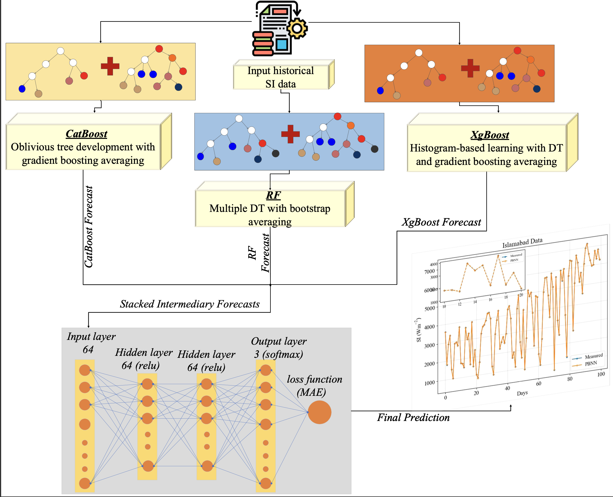

# **Parallel Boosting Neural Network with Mutual Information for Day-Ahead Solar Irradiance Forecasting**
## Abstract
The transition to sustainable energy has become imperative due to the depletion of fossil fuels. Solar energy presents a viable alternative owing to its abundance and environmental benefits. However, the intermittent nature of solar energy requires accurate forecasting of solar irradiance (SI) for reliable operation of photovoltaics (PVs) integrated systems. Traditional deep learning (DL) models and decision tree (DT)-based algorithms have been widely employed for this purpose. However, DL models often demand substantial computational resources and large datasets, while DT algorithms lack generalizability. To address these limitations, this study proposes a novel parallel boosting neural network (PBNN) framework that integrates boosting algorithms with a feedforward neural network (FFNN). The proposed framework leverages three boosting DT algorithms, Extreme Gradient Boosting (XgBoost), Categorical Boosting (CatBoost), and Random Forest (RF) regressors as base learners, operating in parallel. The intermediary forecasts from these base learners are concatenated and input into the FFNN, which assigns optimal weights to generate the final prediction. The proposed PBNN is trained and evaluated on two geographical datasets and compared with state-of-the-art techniques. The mutual information (MI) algorithm is implemented as a feature selection technique to identify the most important features for forecasting. Results demonstrate that when trained with the selected features, the mean absolute percentage error (MAPE) of PBNN is improved by 46.9%, and 73.9% for Islamabad and San Diego city datasets, respectively. Furthermore, a literature comparison of the PBNN is also performed for robustness analysis.
## Image

# Getting Started
Follow the steps below to set up and run the code for short-term global horizontal irradiance forecasting.

## Prerequisites
Ensure you have the following software installed: 
- Python 3.10.9 or above 

Required libraries:  
 -  NumPy 
 -  Pandas 
 -  Scikit-learn 
 -  CatBoost 
 -  Matplotlib 
 -  Seaborn 
 -  TensorFlow 
 -  Keras 
 -  RandomForest 
 -  Xgboost 

# Running the Code
## Step 1: Data Preprocessing

## Step 2: Model Training and Evaluation

## Step 3: Visualization

## Reference

